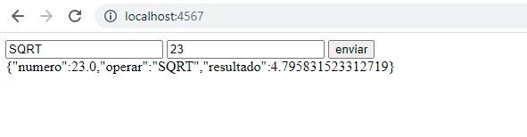
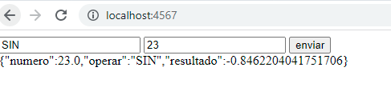
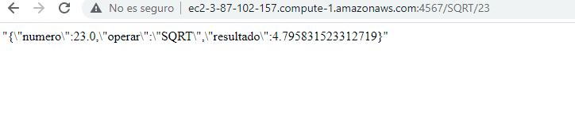

"# Arsw_Parcial2Robin" 

Servicio que alterna entre los dos servicios cuando esten montados en aws
donde resive la funcion y el numero y retorna el resultado de la operacion

AWS 

para correr en ec2 corremos el siguiente comando 
java -cp "target/classes:target/dependency/*" edu.escuelaing.arem.App

y probamos un ejemplo

